# Shader4Unity_Commented

### C5

#### 基本

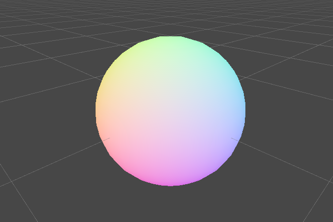

### C6

#### 逐顶点兰伯特漫反射

背部带锯齿

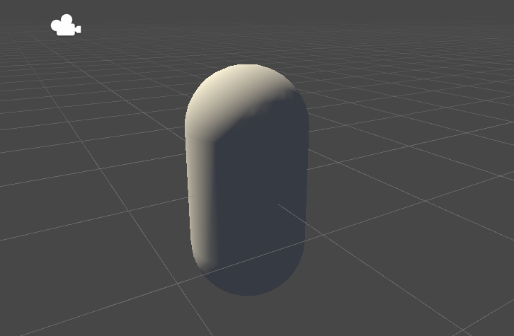

#### 逐像素兰伯特漫反射

不带锯齿，背光面明暗一致

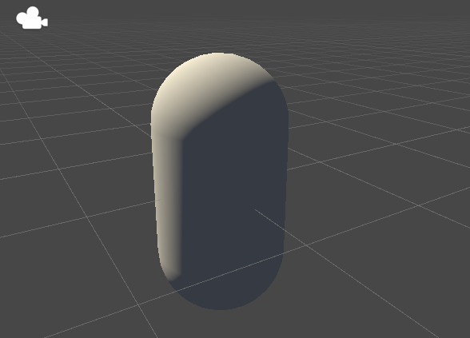

#### 逐像素半兰伯特漫反射

使背光面也有明暗变化

#### 逐顶点高光反射

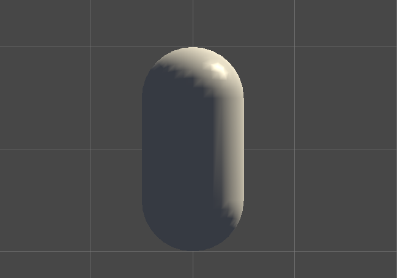

#### 逐像素高光反射

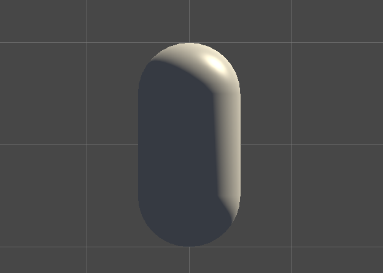

### C7

#### Blinn-Phone纹理

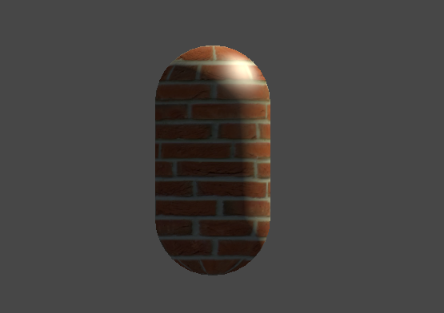

#### NormalMap: tangent space&world space

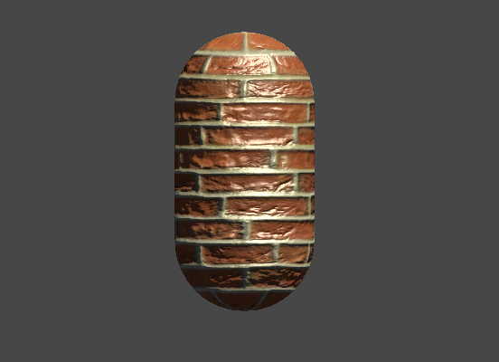

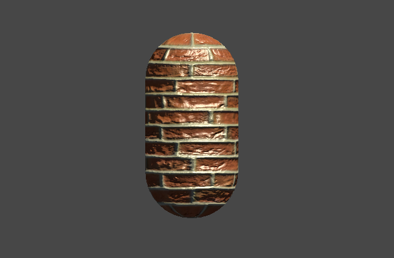

#### RampTexture

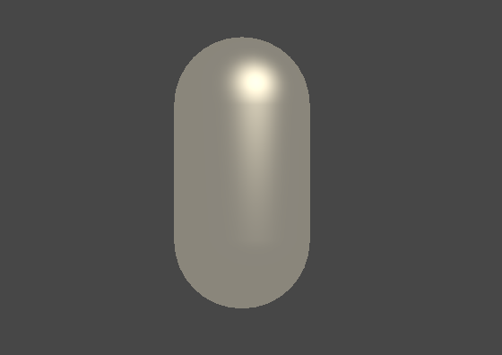

#### MaskTexture

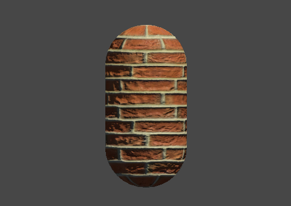

### C8

#### 透明度测试

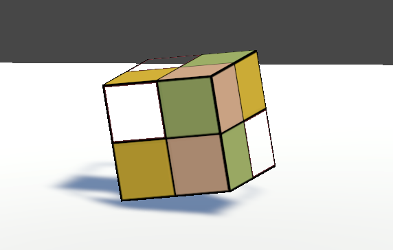

#### 透明混合

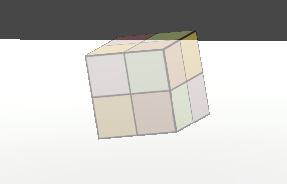

#### 透明混合zwrite

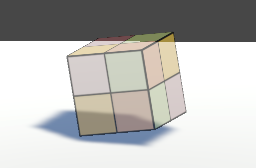

#### 双面透明混合

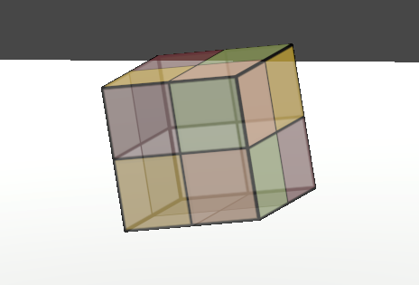