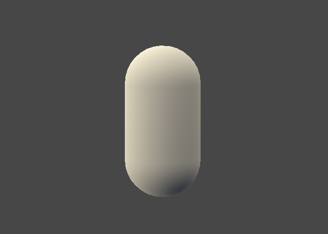

# Shader4Unity_Commented

### C5

#### 基本

### C6

#### 逐顶点兰伯特漫反射

背部带锯齿

#### 逐像素兰伯特漫反射

不带锯齿，背光面明暗一致

#### 逐像素半兰伯特漫反射

使背光面也有明暗变化

#### 逐顶点高光反射

#### 逐像素高光反射

### C7

#### Blinn-Phone纹理

#### NormalMap: tangent space&world space

#### RampTexture

#### MaskTexture

### C8

#### 透明度测试

#### 透明混合

#### 透明混合zwrite

#### 双面透明混合

