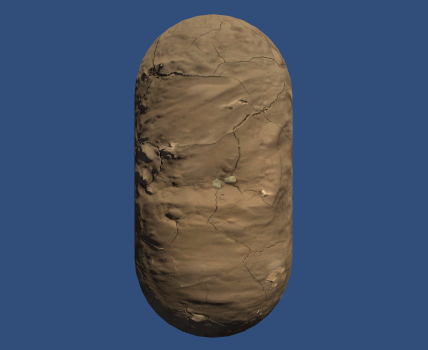

# ShaderQuickCheck

### *Intro*

> This is a shader checkhouse, as well as a Unity project with multiple test scenes, materials, and shaders. You can click on the effects hyperlink under contents to find the CG code of the main shader, which can be modified to GLSL, HLSL, and Vulkan GLSL using chatgpt to add to the project. Or load a Unity project to find C#, materials, and model usage. Thanks to Shader for our essential book resources. At the moment I am gradually expanding into more complex effects.
>

***Test Platform***: **Unity2021**

***Shader***: **CG**...

### ***Contents***

- [Basic](Assets/Shader/C5_OriginShader.shader)
- [逐顶点兰伯特漫反射](Assets/Shader/C6_DiffuseVertex.shader)
- [逐像素兰伯特漫反射](Assets/Shader/C6_DiffuseFragment.shader)
- [逐像素半兰伯特漫反射](Assets/Shader/C6_HalfLambert.shader)
- [逐顶点高光反射](Assets/Shader/C6_SpecularVertex.shader)
- [逐像素高光反射](Assets/Shader/C6_SpecularFragment.shader)
- [Blinn-Phone纹理](Assets/Shader/C6_Blinn-Phone.shader)
- [NormalMap: tangentspace](Assets/Shader/C7_NormalTangnentTexture.shader)
- [NormalMap: world space](Assets/Shader/C7_NormalWorldTexture.shader)
- [RampTexture](Assets/Shader/C7_RampTexture.shader)
- [MaskTexture](Assets/Shader/C7_MaskTexture.shader)
- [透明度测试](Assets/Shader/C8_AlphaTest.shader)
- [透明混合](Assets/Shader/C8_AlphaBlend.shader)
- [透明混合zwrite](Assets/Shader/C8_AlphaBlendZWrite.shader)
- [双面透明混合](Assets/Shader/C8_AlphaBlendBothSide.shader)
- [前向渲染](Assets/Shader/C9_ForwardRendering.shader)
- [阴影](Assets/Shader/C9_Shadow.shader)
- [CubeMap](Assets/Scripts/Chapter10/RenderToCubemap.cs)
- [反射](Assets/Shader/C10_Reflection.shader)
- [折射](Assets/Shader/C10_Refraction.shader)
- [Fresnel反射](Assets/Shader/C10_Fresnel.shader)
- [镜面效果](Assets/Shader/C10_Mirror.shader)
- [玻璃效果](Assets/Shader/C10_GlassRefraction.shader)
- [程序纹理](Assets/Scripts/Chapter10/ProceduralTextureGeneration.c)
- [序列帧动画](Assets/Shader/C11_ImageSequenceAnimation.shader)
- [滚动背景](Assets/Shader/C11_ScrollingBackground.shader)
- [流动河流](Assets/Shader/C11_Water.shader)
- [广告牌效应](Assets/Shader/C11_Billboard.shader)
- [亮度、饱和度、对比度](Assets/Shader/C12_BrightSaturateContrast.shader)
- [边缘检测](Assets/Shader/C12_EdgeDetect.shader)
- [高斯模糊](Assets/Shader/C12_GaussianBlur.shader)
- [Bloom](Assets/Shader/C12_Bloom.shader)
- [运动模糊](Assets/Shader/C12_MotionBlur.shader)
- [运动模糊(深图)](Assets/Shader/C13_MotionBlurWithDepthTexture.shader)
- [全局雾效](Assets/Shader/C13_FogWithDepthTexture.shader)
- [卡通风格](Assets/Shader/C14_ToonShading.shader)
- [素描风格](Assets/Shader/C14_Hatching.shader)
- [消融效果](Assets/Shader/C15_Dissolve.shader)
- [水波效果](Assets/Shader/C15_WaterWave.shader)
- [非均匀运动雾](Assets/Shader/C15_FogWithNoise.shader)
- [表面着色器(泥土)](Assets/Shader/C17_BumpedDiffuseSurface.shader)
- [自定义表面着色器 (膨胀)](Assets/Shader/C17_NormalExtrusion.shader)
- [基本PBS](Assets/Prefabs/Chapter18)

### *Effect*

#### 基本

#### 逐顶点兰伯特漫反射

背部带锯齿

#### 逐像素兰伯特漫反射

不带锯齿，背光面明暗一致

#### 逐像素半兰伯特漫反射

使背光面也有明暗变化

#### 逐顶点高光反射

#### 逐像素高光反射

#### Blinn-Phone纹理

#### NormalMap: tangent space&world space

#### RampTexture

#### MaskTexture

#### 透明度测试

#### 透明混合

#### 透明混合zwrite

#### 双面透明混合

#### 前向渲染

#### 阴影

#### CubeMap

#### 反射

#### 折射

#### Fresnel反射

#### 镜面效果

#### 玻璃效果

#### 程序纹理

脚本类名要和C#文件名相同

#### 序列帧动画

#### 滚动背景

#### 流动河流

#### 广告牌效应

OnRenderImage、gpu.built

#### 亮度、饱和度、对比度

#### 边缘检测

#### 高斯模糊

#### Bloom

#### 运动模糊

#### 运动模糊（深度图）

#### 全局雾效

#### 卡通风格

#### 素描风格

#### 消融效果

#### 水波效果

#### 非均匀运动雾

#### 表面着色器（泥土）

#### 自定义表面着色器（膨胀）

#### 基本PBS

### ***TODO***

More Effects, HLSL&OpenGL Refactor
