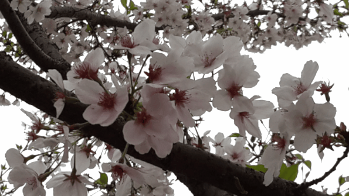

# Shader4Unity_Commented

### C5

#### 基本

### C6

#### 逐顶点兰伯特漫反射

背部带锯齿

#### 逐像素兰伯特漫反射

不带锯齿，背光面明暗一致

#### 逐像素半兰伯特漫反射

使背光面也有明暗变化

#### 逐顶点高光反射

#### 逐像素高光反射

### C7

#### Blinn-Phone纹理

#### NormalMap: tangent space&world space

#### RampTexture

#### MaskTexture

### C8

#### 透明度测试

#### 透明混合

#### 透明混合zwrite

#### 双面透明混合

### C9

#### 前向渲染

#### 阴影

### C10

#### CubeMap

#### 反射

#### 折射

#### Fresnel反射

#### 镜面效果

#### 玻璃效果

#### 程序纹理

脚本类名要和C#文件名相同

### C11

#### 序列帧动画

#### 滚动背景

#### 流动河流

#### 广告牌效应

### C12

OnRenderImage、gpu.built

#### 亮度、饱和度、对比度

#### 边缘检测

#### 高斯模糊

#### Bloom

#### 运动模糊

### C13 

####  运动模糊（深度图）

#### 全局雾效

### C14

#### 卡通风格

#### 素描风格

### C15

#### 消融效果

#### 水波效果

#### 非均匀运动雾

### C17

#### 表面着色器（泥土）

#### 自定义表面着色器（膨胀）

### C18

#### 基本PBS

